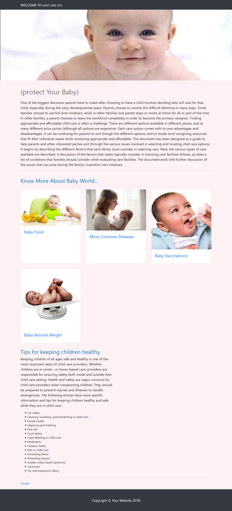
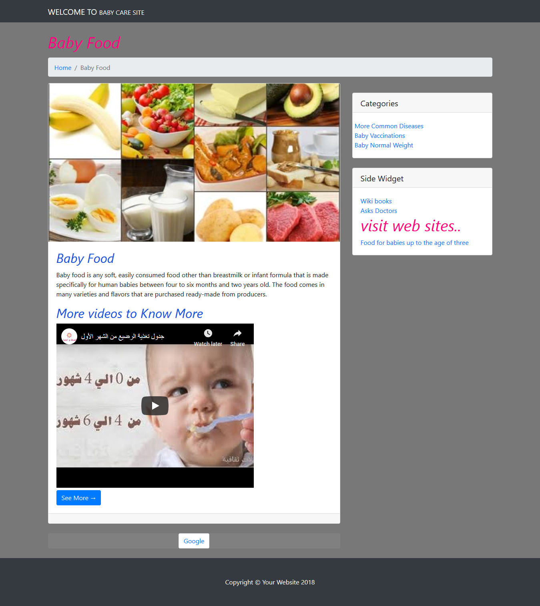
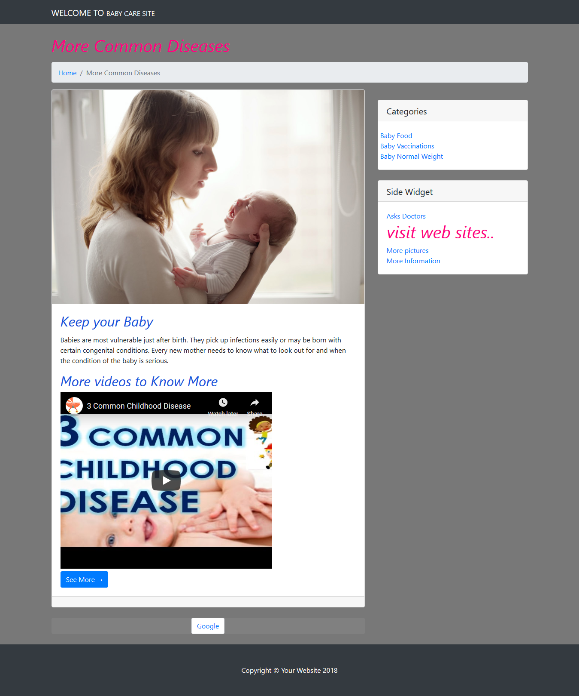
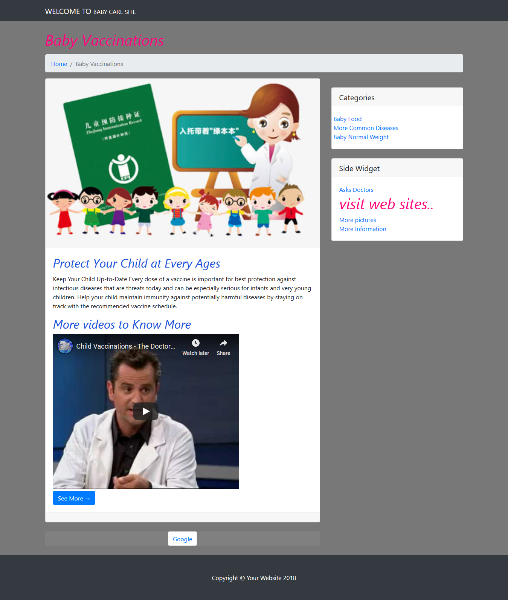
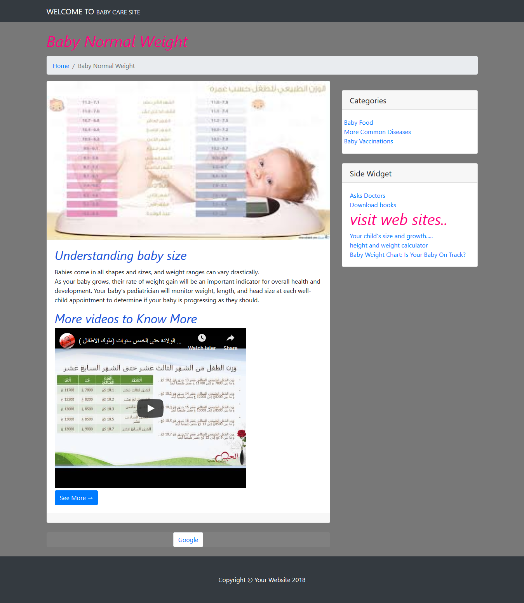

# Web Project
One of the biggest decisions parents have to make after choosing to have a child involves deciding who will care for that child, especially during the early developmental years. Parents choose to resolve this difficult dilemma in many ways. Some families choose to use full-time childcare, while in other families one parent stays or works at home for all or part of the time. In other families, a parent chooses to leave the workforce completely in order to become the primary caregiver.

  

Finding appropriate and affordable child care is often a challenge. There are different options available in different places, and at many different price points (although all options are expensive). Each care option comes with its own advantages and disadvantages. It can be confusing for parents to sort though the different options, and to locate local care giving resources that fit their individual needs while remaining appropriate and affordable.

This document has been designed as a guide to help parents and other interested parties sort through the various issues involved in selecting and locating child care options. It begins by describing the different factors that each family must consider in selecting care. Next, the various types of care available are described. A discussion of the factors that states typically consider in licensing care facilities follows, as does a list of conditions that families should consider while evaluating care facilities. The document ends with further discussion of the issues that can arise during the family's transition into childcare.

## screen from website:

